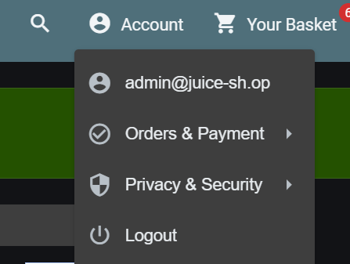

# Finding 1: SQL Injection — Login Bypass

- **Category:** Injection (OWASP A05:2025)
- **Location:** `/rest/user/login`
- **Severity:** High
- **Status:** Confirmed

## Description

The login form's email field does not sanitize input, allowing a classic SQL injection payload to bypass authentication.

## Steps to Reproduce

1. Navigate to the login page.
2. In the email field, enter: `' OR 1=1--`
3. Enter any value in the password field.
4. Submit — login succeeds without valid credentials.

## Evidence

## Impact

An attacker could log in as any user, including an admin account, without knowing credentials. This could lead to full account takeover and access to sensitive user data.

## Detection Notes

The application's internal challenge tracker confirmed successful exploitation via the 2-star `loginAdminChallenge` (Login Admin), but no corresponding HTTP access log (e.g. request method, path, status code) was observed in the container's stdout logs.

This represents a logging gap — in a production environment, the absence of structured access logs would make this kind of attack significantly harder to detect after the fact.

**Recommended remediation:** enable access logging middleware (e.g. Morgan for Express) with output piped to a centralized logging system, so authentication requests are captured regardless of application-level "challenge" instrumentation.

## Remediation

- Use parameterized queries / ORM methods instead of raw string concatenation in SQL queries.
- Add input validation on the email field format before it reaches the database layer.
