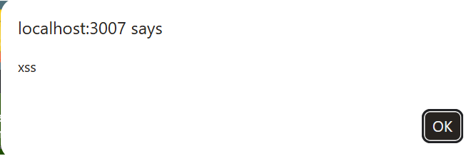
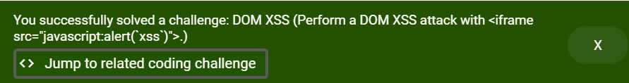

# Finding 2: DOM-Based Cross-Site Scripting (XSS)

- **Category:** DOM XSS (OWASP A05:2025 — Injection)
- **Location:** Product search feature (client-side rendering)
- **Severity:** Medium
- **Status:** Confirmed

## Description

The search feature's client-side JavaScript writes user input directly into the DOM without sanitization. Because this happens entirely in the browser, the malicious payload never touches the server.

## Steps to Reproduce

1. Navigate to the search bar.
2. Enter payload: `<iframe src="javascript:alert(xss)">`
3. Submit — a JavaScript alert executes immediately.

## Evidence

## Impact

An attacker could craft a malicious link (e.g. `http://site.com/#/search?q=<payload>`) and send it to a victim. If clicked, arbitrary JavaScript executes in the victim's browser — enabling session hijacking, cookie theft, or actions performed on the victim's behalf. Since the payload lives in the URL fragment/client state, it can be especially easy to disguise in a shortened link.

## Detection Notes

Unlike Finding 1 (SQLi), this attack is **client-side only** — the payload is processed by JavaScript already loaded in the browser and never sent to or logged by the server. This means traditional server-side logging, WAFs, or access logs would **not** detect this attack at all.

Detection would instead require client-side controls: a strict Content Security Policy (CSP) to block inline/`javascript:` execution, or browser-based monitoring (e.g. CSP violation reporting endpoints).

## Remediation

- Avoid directly injecting user input into the DOM (e.g. via `innerHTML`).
- Use safe DOM APIs (`textContent`, sanitization libraries like DOMPurify).
- Implement a CSP that blocks `javascript:` URIs and inline script execution.
