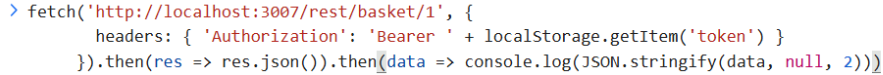
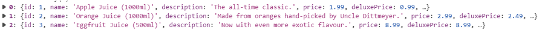

# Finding 3: Broken Access Control (IDOR) — Basket Endpoint

- **Category:** A01:2025 — Broken Access Control
- **Location:** `GET /rest/basket/{id}`
- **Severity:** Medium
- **Status:** Confirmed

## Description

The basket endpoint does not verify that the authenticated user owns the requested basket ID. Any logged-in user can retrieve any other user's basket contents simply by changing the numeric ID in the request.

## Steps to Reproduce

1. Log in as a normal user (own basket ID was 6).
2. Open browser console, retrieve auth token from local storage.
3. Send a manual authenticated request to a different basket ID:

```js
fetch('http://localhost:3007/rest/basket/1', {
  headers: { 'Authorization': 'Bearer ' + localStorage.getItem('token') }
}).then(res => res.json()).then(data => console.log(JSON.stringify(data, null, 2)))
```

4. Response returns full basket contents for `UserId: 1` — items, quantities, prices, timestamps — despite being logged in as a different user.

## Evidence





## Impact

Any authenticated user can enumerate basket IDs (1, 2, 3...) to view other users' shopping activity — a privacy violation. In a real e-commerce system this could expose purchase history, and depending on the API, potentially allow **modifying** or **deleting** another user's basket too.

## Detection Notes

Unlike the DOM XSS finding, this request **does** go to the server, so it's server-side observable. In production, this pattern would show as a single authenticated user making sequential requests to many different resource IDs in a short time window — a classic enumeration signature that could be caught by rate-limiting or anomaly detection on ID-sequential access patterns.

## Remediation

- Enforce object-level authorization on the server — verify the requesting user's ID matches the basket's `UserId` before returning data (or use a 403/404 response if not).
- Consider using non-sequential, unguessable IDs (UUIDs) for resources as defense-in-depth, though this should never replace proper authorization checks.
