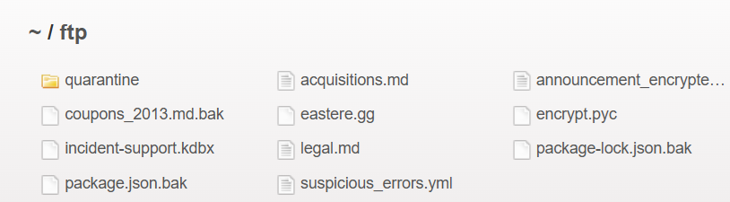
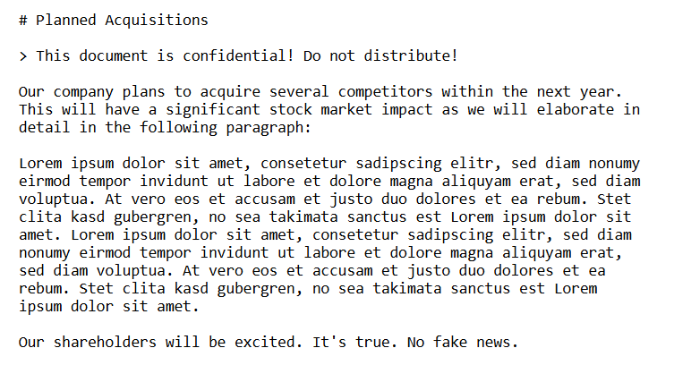

# Finding 4: Sensitive Data Exposure — Unprotected FTP Directory

- **Category:** A02:2025 — Security Misconfiguration
- **Location:** `/ftp` directory
- **Severity:** High
- **Status:** Confirmed

## Description

The application exposes an `/ftp` directory listing publicly, with no authentication required. The directory contains multiple internal files, including business-confidential documents and backup files that should not be accessible externally.

## Steps to Reproduce

1. Navigate to `http://localhost:3007/ftp` while **not logged in**.
2. Directory listing is returned, showing files including `acquisitions.md`, `legal.md`, `coupons_2013.md.bak`, `incident-support.kdbx`, `package.json.bak`, and others.
3. Open `acquisitions.md` directly — file loads with no access control.

## Evidence

## Impact

This directory exposes what appears to be confidential business planning information (e.g. acquisition plans, explicitly marked as market-sensitive), legal documents, and backup config/credential-adjacent files.

In a real-world scenario, exposure of acquisition plans before public announcement could constitute material non-public information — a serious business and potentially legal/regulatory risk (insider trading implications). Backup files may also expose internal source code, dependency versions, or configuration secrets, aiding further attacks.

## Detection Notes

This is a server-side accessible directory, so requests to `/ftp/*` would appear in standard access logs. In production, this could be detected via monitoring for requests to sensitive file extensions (`.bak`, `.kdbx`, `.md` outside expected paths) or via automated content-discovery scanning as part of routine security testing.

## Remediation

- Remove the `/ftp` directory from the production web root entirely, or restrict access via authentication and role-based authorization.
- Backup files (`.bak`) should never be stored in a web-accessible directory — enforce this via deployment/CI checks that block committing or deploying such extensions to public paths.
