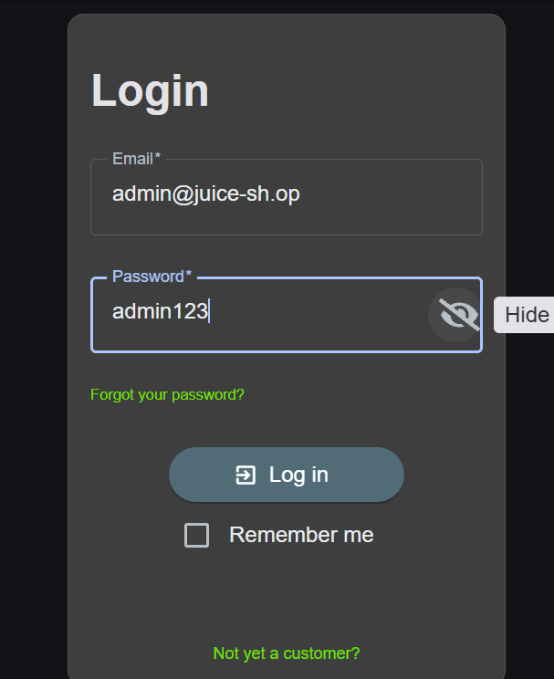

# Finding 5: Broken Authentication — Weak Admin Password (Brute Force)

- **Category:** A07:2025 — Authentication Failures
- **Location:** `POST /rest/user/login`
- **Severity:** High
- **Status:** Confirmed

## Description

The application does not enforce a strong password policy on privileged accounts, and does not implement rate-limiting or account lockout on the login endpoint. This allowed the administrator account's password to be discovered via an automated brute-force attack using a common password wordlist.

## Steps to Reproduce

1. Captured a login request to `/rest/user/login` using Burp Suite's proxy.
2. Sent the request to Burp Intruder, setting the email to the known admin address and marking the password field as the attack position.
3. Loaded a common-password wordlist (SecLists — `xato-net-10-million-passwords-1000.txt`) as the payload set.
4. Ran the attack (Sniper mode) against all 1000 candidate passwords.
5. Identified a response with a different length/status code than the rest, indicating success.
6. Confirmed password `admin123` allowed successful login as the administrator account.

## Evidence

## Impact

An attacker could gain full administrative access to the application using a widely available password list and no specialized tools beyond a free proxy utility. Since no lockout or rate-limiting was encountered during 1000 rapid login attempts, this attack is trivial to automate and would succeed quickly against any account using a common password.

## Detection Notes

A brute-force attack of this kind would generate a large volume of failed login requests (HTTP 401) from a single source in a short time window — a very detectable pattern. However, since Juice Shop does not appear to log HTTP-level access requests by default (noted in Findings 1/2), this activity would go unnoticed without additional logging.

In production, this should trigger:
- Rate-limiting/throttling per IP or account.
- Account lockout after N failed attempts.
- Alerting on abnormal login-failure volume.

## Remediation

- Enforce a strong password policy (minimum length, complexity, block common passwords via a check against known-breached password lists).
- Implement rate-limiting and progressive delays on the login endpoint.
- Add account lockout or CAPTCHA after a threshold of failed attempts.
- Log authentication failures with source IP for monitoring.
