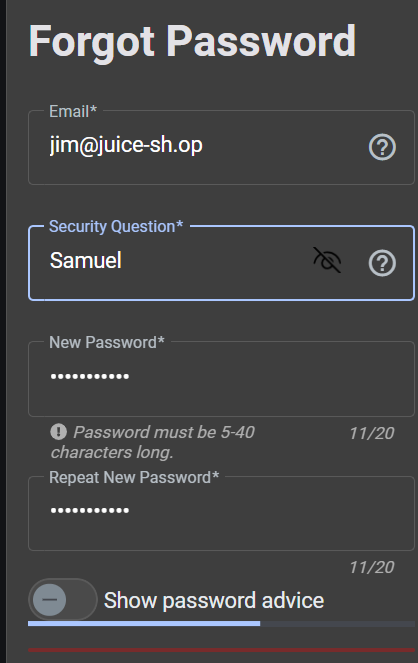

# Finding 6: Broken Authentication — Weak Security Question (Password Reset)

- **Category:** A07:2025 — Authentication Failures
- **Location:** Password reset / "Forgot your password?" flow
- **Severity:** Medium
- **Status:** Confirmed

## Description

The password reset mechanism relies on a security question with a publicly researchable answer, and does not rate-limit or lock out repeated incorrect attempts. Combined with OSINT-style research on in-app content (user reviews referencing pop-culture context), the security answer could be deduced without any technical exploitation.

## Steps to Reproduce

1. Identified target user's email (`jim@juice-sh.op`) via product reviews elsewhere in the app.
2. Browsed product reviews and found a review left by Jim under the Green Smoothie product, mentioning a "replicator."
3. Searched "replicator," identifying it as a reference to Star Trek.
4. Searched "Jim Star Trek," identifying the likely account owner as a reference to James T. Kirk.
5. Navigated to "Forgot your password?" and entered the target email.
6. The account's security question asked for the eldest sibling's middle name.
7. Researched Kirk's family background and found his brother's middle name.
8. Submitted the researched answer (`Samuel`) and successfully reset the password.

## Evidence

## Impact

Any user's account can be taken over by an attacker willing to do light research on personal/contextual clues left in the application (e.g. reviews, profile content) combined with public information research. This is a lower-skill, no-tooling attack — meaning it's accessible to a much wider range of attackers than the SQLi or brute-force findings.

## Detection Notes

Repeated failed security-question attempts against the same account would be a detectable pattern (similar signature to the admin brute-force in Finding 5) — multiple POST requests to the reset endpoint for one email in a short window. As with prior findings, this would require access-log level monitoring to catch, since Juice Shop does not appear to log this by default.

## Remediation

- Avoid knowledge-based security questions entirely — they are inherently guessable or researchable.
- Prefer stronger recovery mechanisms (email-based reset links with expiring tokens, multi-factor authentication).
- If security questions must be used, avoid predictable/public-answer categories (family names, birthplaces) and rate-limit/lock out repeated attempts.
